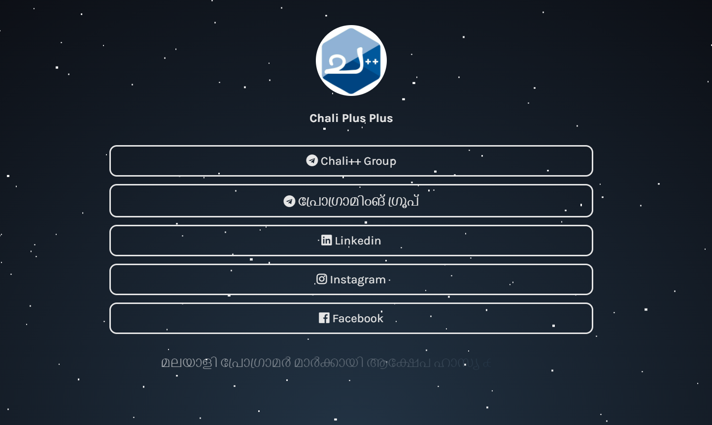

<h1 align="center">:evergreen_tree: Linktree</h1>
<h3 align="center">Simple site to group chaliplusplus social links in one place.</h3>

  
  
  
  

  
  

  <a href="#bulb-about-the-project">About the project</a>&nbsp;&nbsp;&nbsp;|&nbsp;&nbsp;&nbsp;
  <a href="#rocket-getting-started">Getting started</a>&nbsp;&nbsp;&nbsp;|&nbsp;&nbsp;&nbsp;
  <a href="#star2-extras">Get in touch</a>

---

  

---

## :bulb: About the project

- This is an open source project that serves as a free alternative to the Linktree website, made only in html and css.

- [Deploy](https://ajmalbinnizam.github.io/linktree)

## :rocket: Getting started

- After downloading this repository, make changes to images and text in the `index.html` file. If desired, change the colors and fonts in the `style.css` file.

---

## :star2: Extras
- [Shields.io](https://shields.io/)
- [Github Emojis](https://gist.github.com/rxaviers/7360908)

---

Made with ♥ by Ajmal Bin Nizam :wave: [Get in touch](https://instagram.com/ajmalbinnizam)
